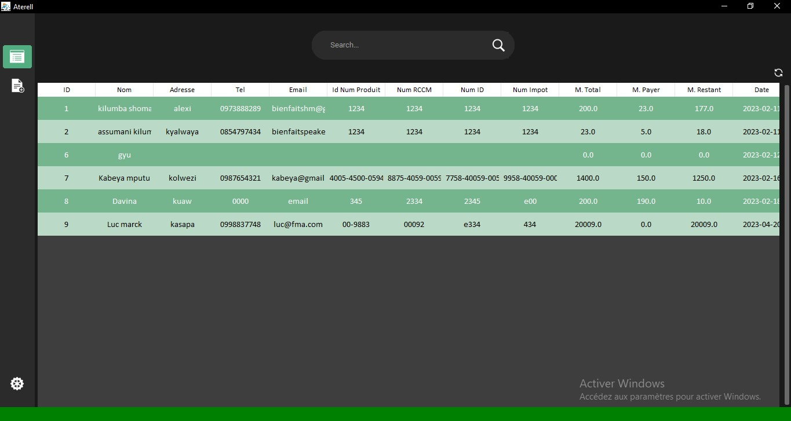
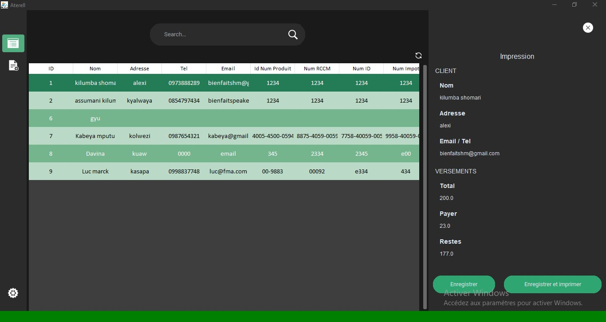
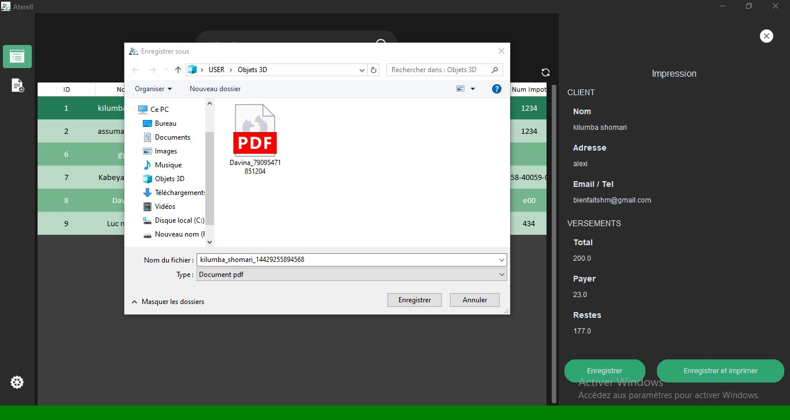
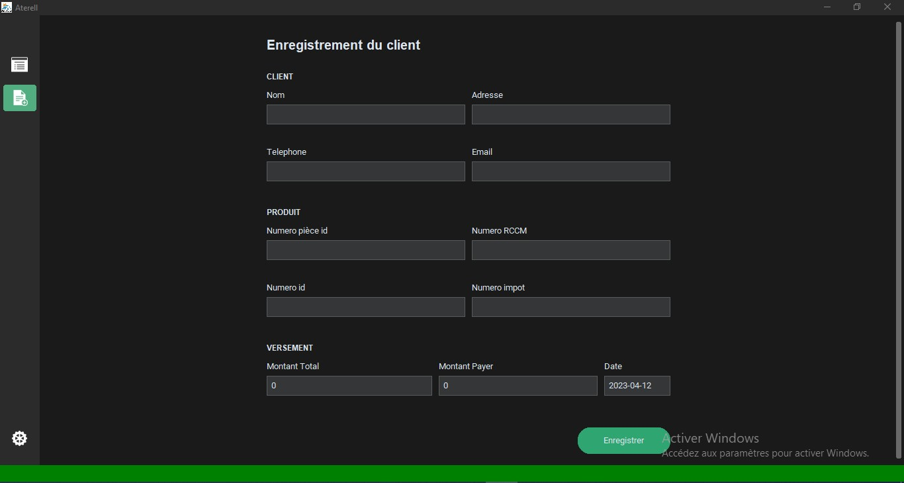
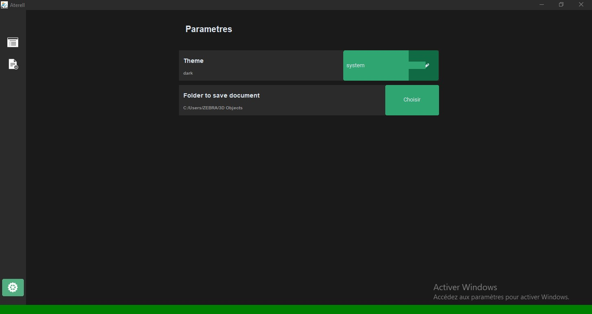
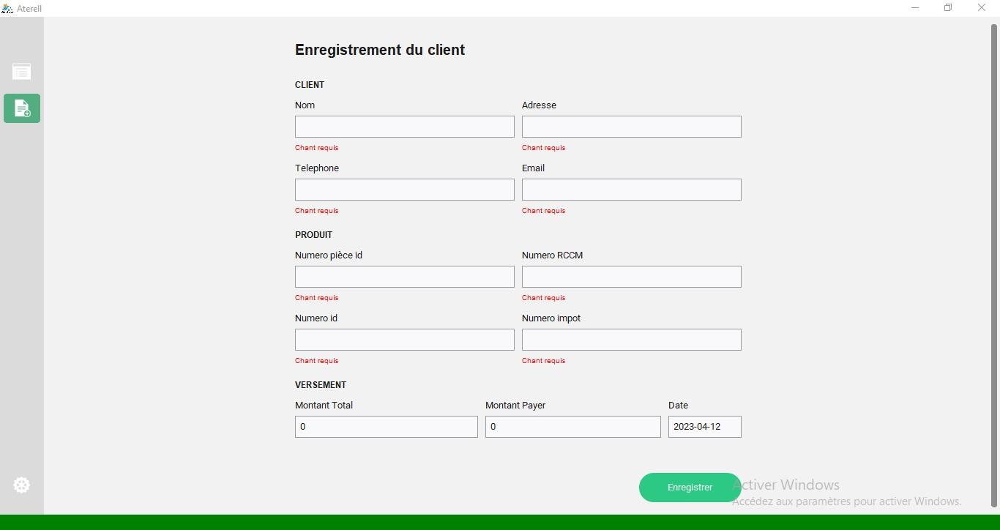

# Aterel

> aterel est une application des gestions des contrats de clients elle a comme fonctionnalite

1. Lire les contrats deja enregistrer
2. Rechercher/ Refresh les contrat par leurs noms
3. Creer / Supprimer un nouveau contrat
4. Enregister les contrats sous forme PDF
5. Imprimer le contrat
6. Changer le dossier d'enregistrement par defaut
7. Theme sombre et claire

## Impression et Enregistrement en pdf du contrat

Pour imprimer

1. Selectionner le contrat
2. Appuyer sur Enter ou Doubler Cliquer pour faire sortier le sibebar ou on nous donnes les information en detail du contrat

## Suppession du contrat

Pour supprimer, appuyer sur le bouton delete du clavier

## Screens shoot

### Home screen

### Detail screen

### Save screen

### Delete screen

### Edition screen

### Edition error form screen

### Setting screen

### White Edition screen

### Contrat PDf

## Lastest Release

>la version beta  [aterel_v.0.0.1.beta.exe](https://github.com/bienfaitshm/aterelproject/releases/tag/v0.2.0-alpha)

## Devs contacts

Bienfait shomari

email: bienfaitshm@gmail.com

whatsapp: +243973888289
